# ☁️ Azure DevOps & Cloud Capstone Project

> **Author:** Akash Nadigepu &nbsp;|&nbsp; 
> **Infrastructure Repo:** [capstone-infra](https://github.com/Akash-Nadigepu/capstone-infra)

---

## 📌 Table of Contents

- [Problem Statement](#-problem-statement)
- [Solution Overview](#-solution-overview)
- [Infrastructure Architecture](#-infrastructure-architecture)
- [CI/CD Pipelines](#-cicd-pipelines)
  - [Backend Pipeline](#backend-pipeline-spring-boot)
  - [Frontend Pipeline](#frontend-pipeline-react)
  - [Infrastructure Pipeline](#infrastructure-pipeline-terraform)
- [12-Factor App Principles](#-12-factor-app-principles)
- [High Availability & Disaster Recovery](#-high-availability--disaster-recovery)
- [Security Controls](#-security-controls)
- [Monitoring & Observability](#-monitoring--observability)
- [Project Phases](#-project-phases)
- [Terraform Resources Summary](#-terraform-resources-summary)

---

## 🎯 Problem Statement

The objective of this project is to design, implement, and demonstrate a **cloud-native application deployment on Microsoft Azure**. This includes:

- **Infrastructure as Code (IaC)** for resource provisioning
- **CI/CD pipelines** for automation and continuous delivery
- **Disaster Recovery (DR)** strategy for resilience and high availability

---

## 🧩 Solution Overview

A full-stack application (**Spring Boot** backend + **React** frontend) is deployed into **Azure Kubernetes Service (AKS)** across two geographic regions:

| Region | Role | Provisioning Tool |
|---|---|---|
| Poland Central | Primary | Terraform |
| Korea Central | Disaster Recovery (Standby) | Bicep |

Key platform components include:
- **Azure Key Vault** for secrets management
- **Azure Traffic Manager** for global routing and failover
- **Azure Monitor** for observability and alerting
- **Azure Container Registry (ACR)** for container image storage

---

## 🏗️ Infrastructure Architecture

The architecture spans two Azure regions in an **Active-Passive** configuration, with Traffic Manager directing traffic to the primary cluster and failing over to the secondary automatically.

)

### Primary Region — Poland Central (Terraform)

- AKS cluster running `user-service` and `frontend-service`
- Azure Container Registry (ACR)
- Azure Key Vault for secrets
- Azure SQL Database
- Virtual Network (VNet) with dedicated subnets for AKS, SQL, and Application Gateway
- Application Gateway + Ingress Controller
- Azure Traffic Manager for global routing

### Secondary Region — Korea Central (Bicep)

- Standby AKS Cluster (Active-Passive failover)
- ACR Geo-replication
- Traffic Manager linked for automated failover

---

## 🔄 CI/CD Pipelines

There are **3 independent pipelines** in Azure DevOps — one each for the backend, frontend, and infrastructure.

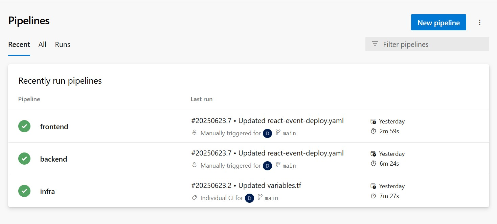

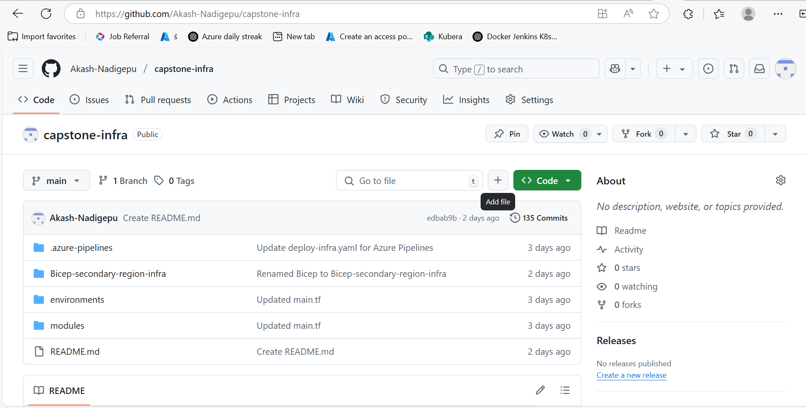

---

### Backend Pipeline (Spring Boot)

#### Stage 1 — Build & Push to ACR

Builds the Java Spring Boot Docker image and pushes it to Azure Container Registry.

- **Tool:** Docker@2  
- **Dockerfile:** `Backend-Java/Event_Managment/Dockerfile`  
- **Image Tag:** `primary.azurecr.io/backend/event-management:$(Build.BuildId)`

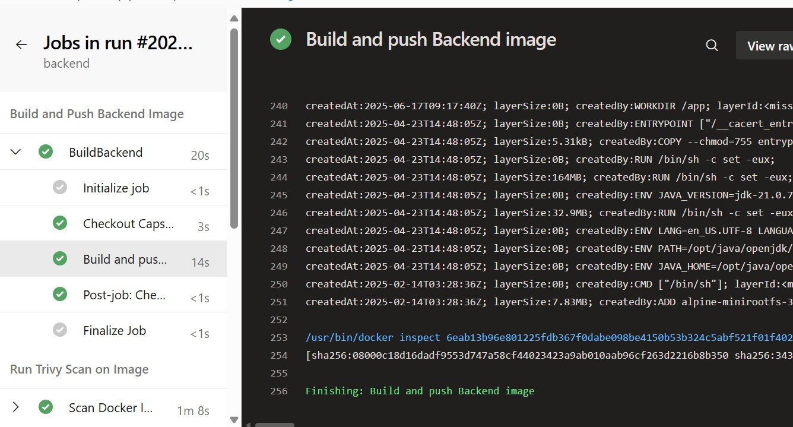

#### Stage 2 — Trivy Vulnerability Scan

Scans the container image for known vulnerabilities before deployment.

- **Tool:** Trivy CLI  
- **Severity Levels Checked:** HIGH, CRITICAL, MEDIUM  
- **Fail Criteria:** Build fails if unignored vulnerabilities are detected

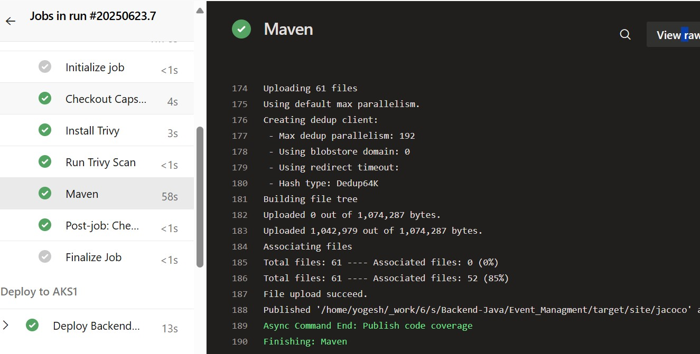

#### Stage 3 — Maven Build & Unit Testing

- **Tool:** Maven@4  
- Compiles the Java project and runs unit tests via Surefire  
- Generates **JaCoCo** test coverage reports  
- Publishes JUnit results for visibility in Azure DevOps

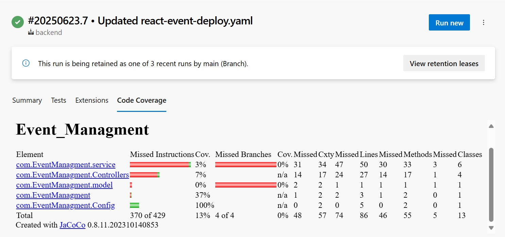

#### Stage 4 — Snyk Security Scan

Performs deep open-source dependency scanning across all packages.

- **Tool:** Snyk CLI  
- Authenticates via `SNYK_TOKEN`  
- Outputs results in JSON format for compliance tracking

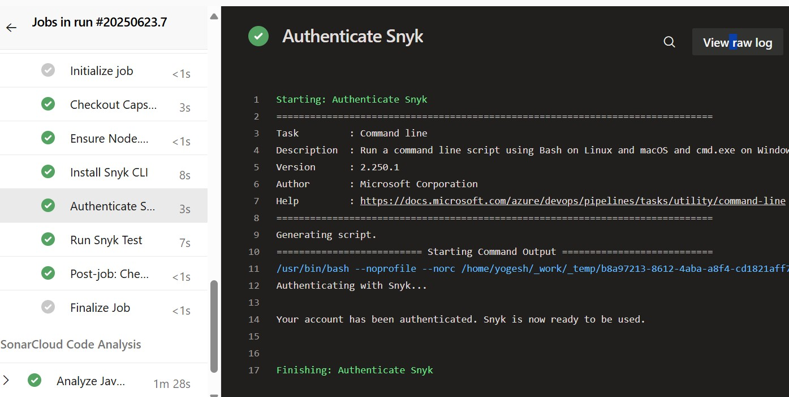

#### Stage 5 — SonarCloud Static Analysis

Publishes a Quality Gate with metrics including code smells, bugs, test coverage, and maintainability.

- **Tools:** SonarCloud + Maven  
- Prepares, runs, and reports analysis results via the SonarCloud dashboard

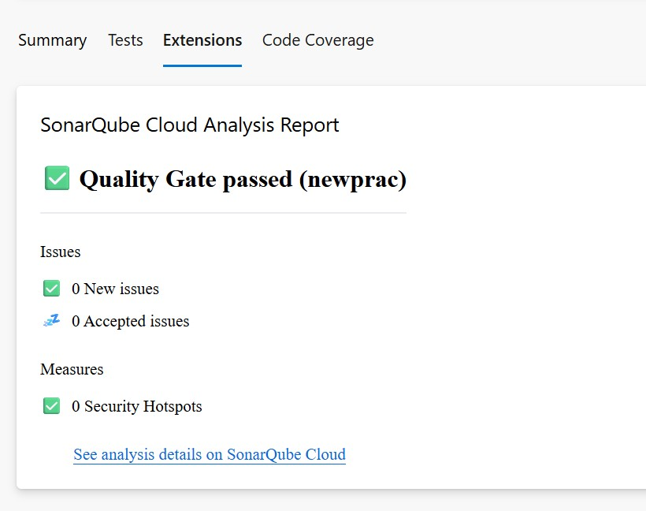

#### Stage 6 — Deploy to AKS (Primary)

- **Cluster:** `aks-1` — Poland Central (Primary)  
- **Tool:** Kubernetes@1  
- **Manifests:** `springboot-deploy.yaml`, `java-springboot-service.yaml`

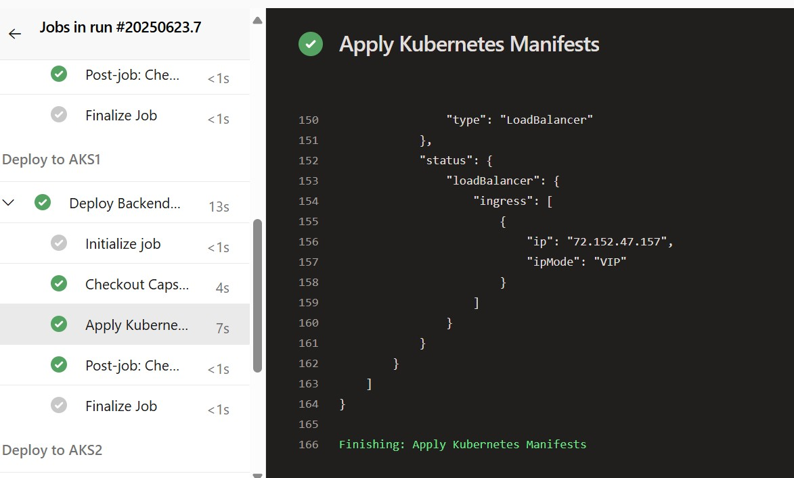

#### Stage 7 — Deploy to AKS (Secondary DR)

- **Cluster:** `aks-2` — Korea Central (Standby)  
- **Tool:** Kubernetes@1  
- **Manifests:** `springboot-deploy.yaml`, `java-springboot-service.yaml`  
- **Purpose:** Mirror deployment for Active-Passive failover support

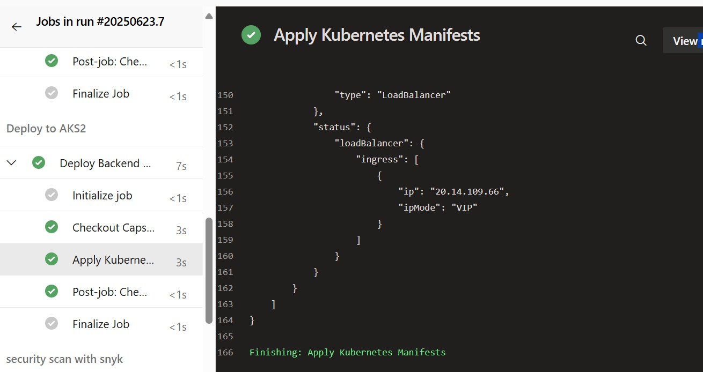

---

### Frontend Pipeline (React)

#### Stage 1 — Build & Push to ACR

Builds the React frontend Docker image and pushes it to ACR.

- **Tool:** Docker@2  
- **Dockerfile:** `Frontend-ReactJs/event-management-dashboard/Dockerfile`  
- **Image Tag:** `primary.azurecr.io/frontend/eventdashboard:$(Build.BuildId)`

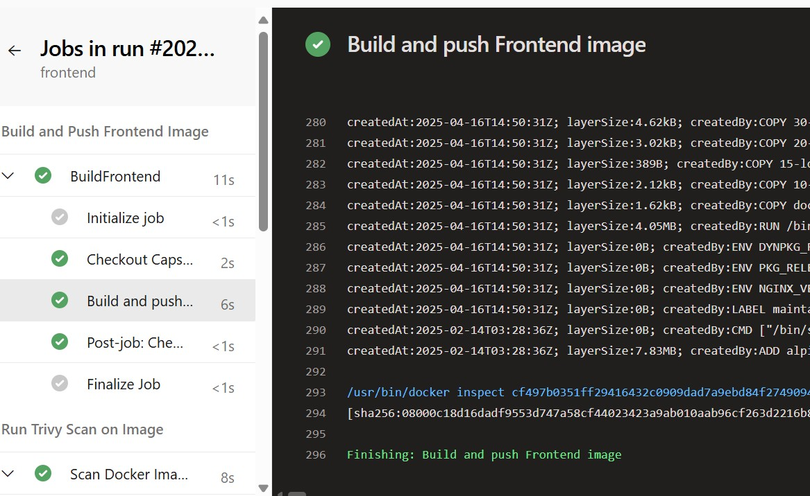

#### Stage 2 — Trivy Vulnerability Scan

Container vulnerability scan for the React app image, failing on HIGH/CRITICAL findings.

#### Stage 3 — Snyk Security Scan

Scans Node.js dependencies via Snyk CLI with JSON report output.

#### Stage 4 — Deploy to AKS (Primary)

- **Cluster:** `aks-1` — Poland Central  
- **Manifests:** `Kubernetes/react-event-deploy.yaml`, `Kubernetes/react-event-service.yaml`

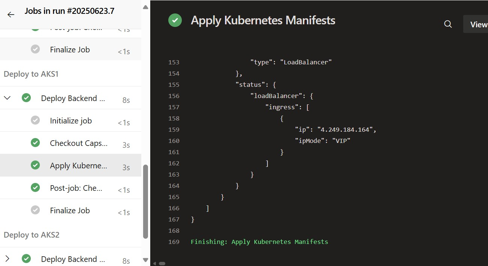

#### Stage 5 — Deploy to AKS (Secondary DR)

- **Cluster:** `aks-2` — Korea Central  
- Mirrors frontend to DR cluster for failover readiness

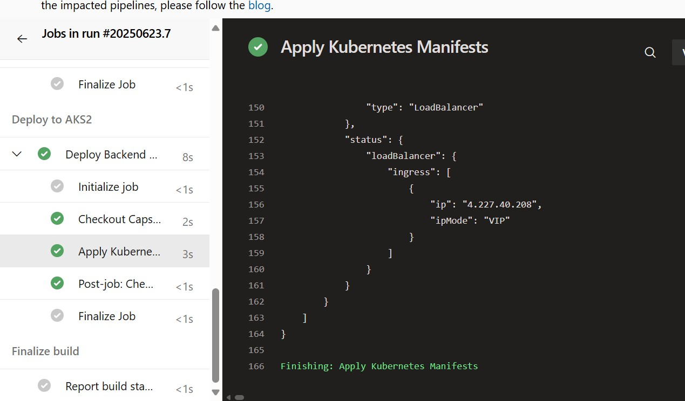

---

### Infrastructure Pipeline (Terraform)

The infra pipeline automates provisioning of the entire multi-region Azure infrastructure using Terraform. It enables:

- Automated resource provisioning via Azure DevOps Pipelines
- Active-Standby AKS setup across Poland Central and Korea Central
- Azure Traffic Manager for intelligent traffic distribution
- Secure networking with NSGs, Key Vault, and minimal external exposure

After applying, all resources are created and visible in the Azure portal:

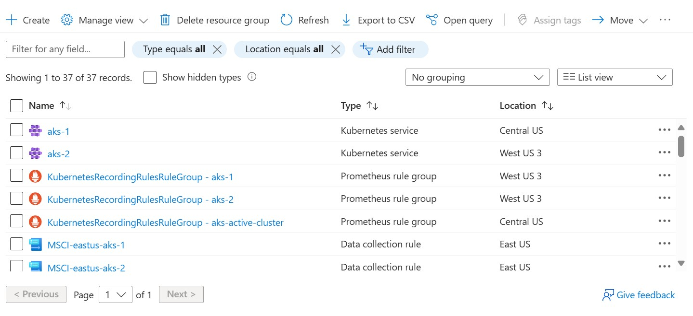

---

## ✅ 12-Factor App Principles

This project adheres to the [12-Factor App](https://12factor.net/) methodology:

| Factor | Implementation |
|---|---|
| **Config** | Stored in environment variables via Azure Key Vault |
| **Logs** | Emitted as `stdout` for ingestion by Azure Monitor |
| **Codebase** | One codebase per service, stored in separate repos |
| **Backing Services** | Azure SQL attached via environment variables |
| **Build/Release/Run** | Enforced through CI/CD pipeline stages |

---

## 🛡️ High Availability & Disaster Recovery

| Concern | Solution |
|---|---|
| **High Availability** | Multi-node AKS clusters + Azure-managed SQL with built-in redundancy |
| **Disaster Recovery** | Azure Traffic Manager + replicated AKS cluster in Korea Central |
| **Failover** | Manual failover capability built into Traffic Manager configuration |
| **Replication** | ACR Geo-replication ensures container images are available in both regions |

The architecture uses an **Active-Passive** model — Poland Central handles live traffic while Korea Central remains on warm standby, ready to accept traffic within minutes.

---

## 🔐 Security Controls

Security is enforced at multiple layers across the infrastructure:

| Layer | Control |
|---|---|
| **Network** | NSGs with only required ports open (80, 443, 8080, 8081) |
| **Secrets** | Azure Key Vault with access restricted to AKS Managed Service Identity (MSI) |
| **Container Security** | Azure Defender for container and registry security |
| **Node Isolation** | AKS nodes deployed in private subnets |
| **Access Management** | Just-in-time access, Azure Policy, and RBAC |
| **Dependency Scanning** | Snyk and OWASP Dependency Check in every pipeline |
| **Image Scanning** | Trivy scans on every Docker build |
| **Code Quality** | SonarCloud Quality Gate enforcement |

---

## 📊 Monitoring & Observability

**Prometheus and Grafana** are deployed in a dedicated `monitoring` namespace within AKS:

- **Prometheus** scrapes metrics from Kubernetes components and application pods
- **Grafana** provides real-time dashboards for cluster health, resource usage, and application performance
- Default and custom dashboards monitor CPU, memory, and pod states

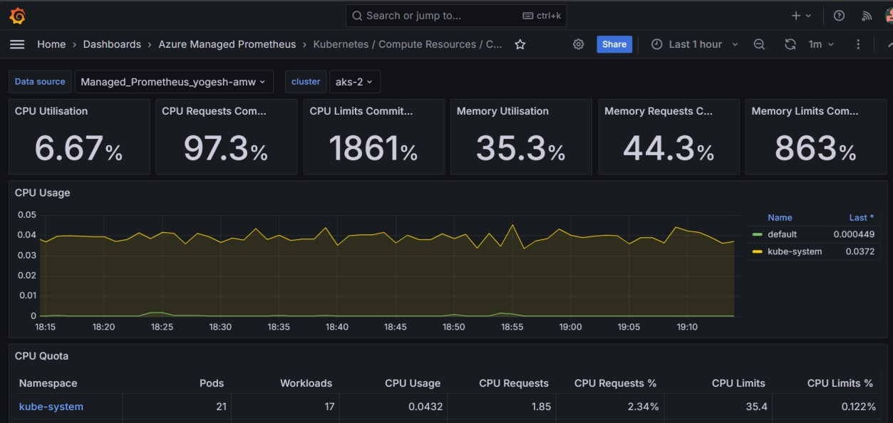

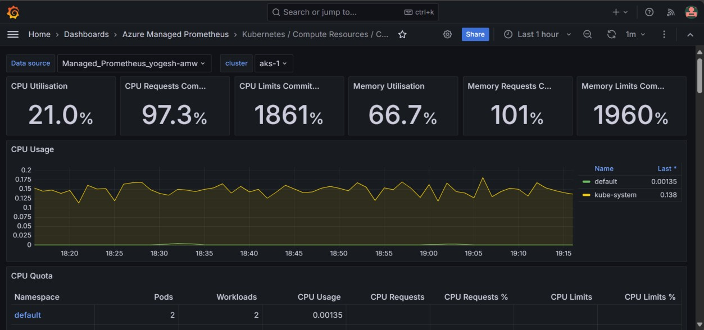

Additionally, **Azure Monitor** and **Application Insights** are configured for:
- Platform-level alerting and SLA/SLO compliance tracking
- Auto-scaling triggers
- Crash analytics and distributed tracing

---

## 📅 Project Phases

### Phase 1 — Planning & Version Control
- Established DevOps culture and defined KPIs
- Understood SRE practices: SLA, SLO, SLI definitions
- Implemented Git and GitFlow branching in Azure Repos
- Set up Azure Boards, Repos, Pipelines, and Artifacts

### Phase 2 — Infrastructure as Code (Terraform)
- Provisioned AKS, ACR, VNets, and secure connectivity (VPN, Bastion, NAT)
- Automated Terraform deployments via Azure Pipelines
- Configured VNet peering and simulated on-premises environment with backup

### Phase 3 — CI/CD Implementation
- Built CI/CD pipelines in YAML for both app services and infrastructure
- Containerized applications, pushed to ACR, deployed to AKS clusters
- Integrated testing tools, Key Vault secrets, and GitHub Actions
- Created Active-Passive AKS DR configuration

### Phase 4 — Monitoring, Logging & Compliance
- Deployed Azure Monitor and Application Insights
- Configured dashboards, alerts, auto-scaling, and crash analytics
- Established SLA/SLO compliance monitoring and system health dashboards

### Phase 5 — Security & Governance
- Deployed Azure Defender for container and registry protection
- Configured NSGs, just-in-time access, and Azure Policy
- Implemented centralized secrets management using Azure Key Vault

---

## 📦 Terraform Resources Summary

| Resource | Details |
|---|---|
| **Resource Group** | `rg-primary` |
| **Virtual Networks** | VNet with public & private subnets per region |
| **NSGs** | Ports: 80, 443, 8080, 8081 |
| **AKS Clusters** | Two clusters — Poland Central & Korea Central, private subnets |
| **Public IPs** | Static IPs per AKS cluster for ingress |
| **Traffic Manager** | Performance-based routing to AKS clusters |
| **Container Registry** | ACR with geo-replication |
| **Key Vault** | Secrets store; access restricted to AKS MSI |
| **Output Variables** | Public IPs, kubeconfigs, Key Vault URI, ACR credentials |

---

## 🔗 Links

- 📁 **Infrastructure Repository:** [github.com/Akash-Nadigepu/capstone-infra](https://github.com/Akash-Nadigepu/capstone-infra)

---

**Built with ❤️ using Azure DevOps · Terraform · AKS · Docker · Spring Boot · React**

